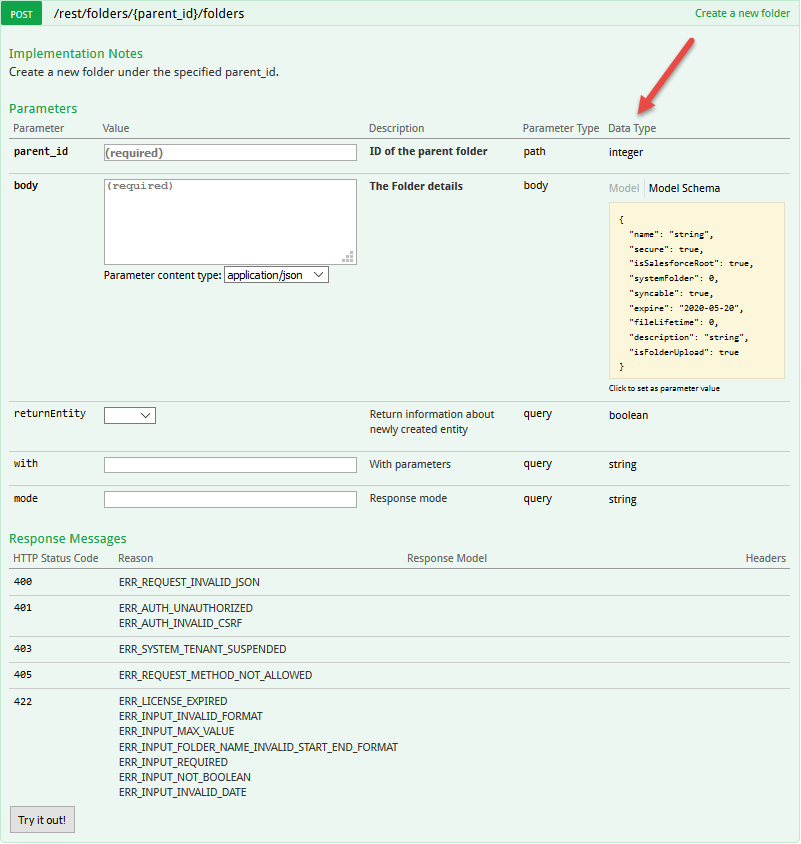
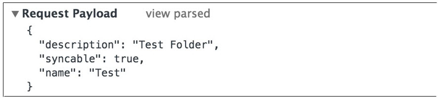
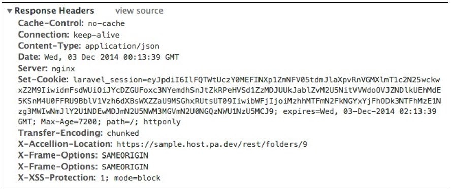
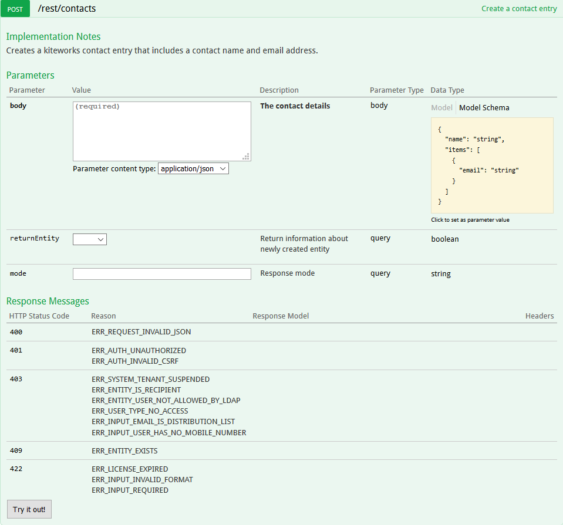
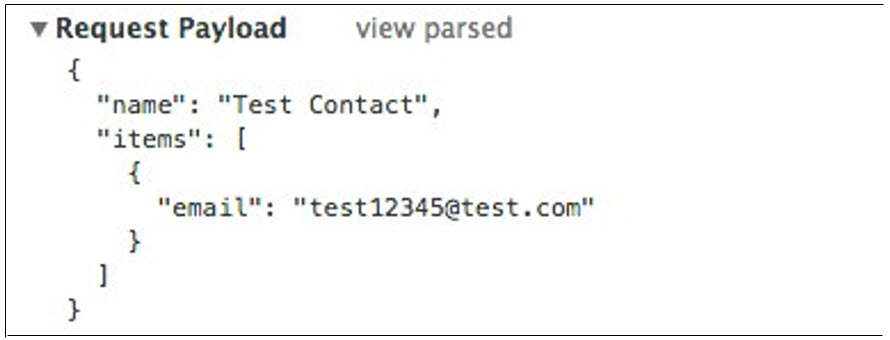
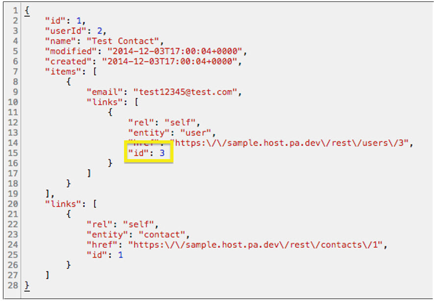
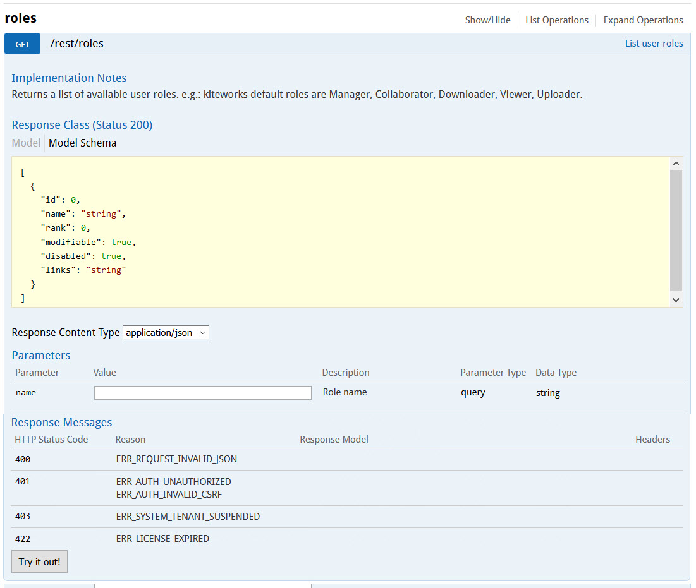
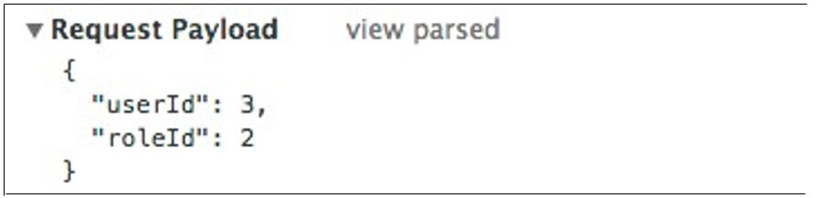

# Creating Objects

In the Developer Documentation website, click on the endpoint under **folders** which is **Create a new folder**. The **parent id** expected in this request is the id of the folder that is being created in the new folder.  

As a creation request for the API, this endpoint requires some information for the object that is being created. The Developer Documentation outlines the format that this information should be provided in. This can be found under the **Data Type** of the body parameter. In this case, the name is the only requirement. The required information is expected to be in the Request Payload of the request. In addition, there are options to add a description and specify if the folder is syncable. If these options are used, that information should also be included in the Request Payload.  

Note that the **Request Payload** is expected to be JSON and that the Content-Type must be **application/json**.  

  

If successful, the response's header will look like this.  

The most important part of this response is the **X-Accellion-Location** field. This is an indicator of which object is being acted upon. In the case of creating an object, this will be the new object that you have created. This will also be a way to get the **id** of the object, for future use.

To add one of your contacts as a downloader and if you do not have any contacts or you would not like to share this folder with any of your existing contacts, you can use the **POST /rest/contacts** endpoint under the **contacts** entity to create another contact.

For this endpoint, you will need to supply a contact name and an email address. The **Request Payload** should look like this.

Again, make note of the **X-Accellion-Location** field in the response header, where you can find the **id** for the contact that was created.

Use the **GET /rest/contacts/{id}** endpoint, filling in the necessary **id** with the one we took from the last response header, to get the information for this contact.

Inside the response for this endpoint, there is an **Items** array, and the first element of that array contains a **links** array. That array contains an element that has a field called **entity** with the value **user**. This indicates that the data in this element corresponds to the **user** that is associated with this **contact**. Inside that element, there should also be an **id** field. This is more clearly shown in the next figure

  

To add a contact to this **folder** as a downloader, go to the folders entity, and click on the **POST /rest/folders/{id}/members** entity. In the actual request, the **id** is the **id** of the folder you want to add the user to. In this case, it would be the **id** of the folder we created earlier in **My Folder**.

The **Request Payload** for this web request should contain both the **userId** for the contact you want to add (which we obtained from the previous web request) and the **roleId**. A comprehensive list of every role and associated **roleId** can be obtained through the **GET /rest/roles** endpoint under the **roles** entity.

From the response of this web request, we can observe that a downloader's corresponding role Id is 2. The **Request Payload** should be formatted as follows.

After successfully performing this, you have created a folder and added a contact to it as a downloader. Now, this contact has visibility into this folder and the ability to download files from it. 
