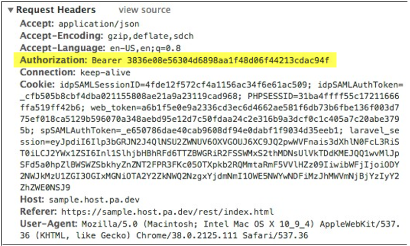

# Creating API Requests

When making web requests to the API from your own application, make sure to include your token in the header for your request. The steps for obtaining this token were outlined in the [Obtaining a Token](#getatoken) section.  

This section will outline how to include the token in your request from a third-party application

Most modern web browsers either come with a set of developer tools, for example, Chrome Developer Tools or have a set that can be found online, for example, Firebug for Firefox. In the developer tools, there will generally be a Network tab that will show all network calls being made through the browser. In addition, there are a number of standalone software application that can be used to do this, for example, Fiddler, Wireshark, Charles Proxy.

Using the developer tools, if an endpoint is executed, the browser sends out request with the following header.  

The most important part of this header is the Authorization field, which contains the word "Bearer" followed by a space, followed by your token string. The word "Bearer" describes the type of token that is being used for authentication. This is the exact format the authorization field in the request headers should be in order to perform this request successfully. It should read exactly like:  

Authorization: Bearer **token string**  

Where **token string** is replaced with the actual token string.

