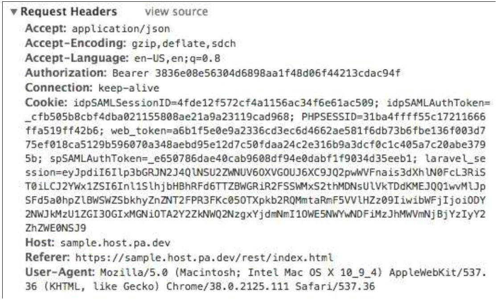

# Creating API Requests

When making web requests to the API from your own application, make sure to include your token in the header for your request. The steps for obtaining this token were outlined in the [Prerequisites](#prerequisites)section of this documentation. This section will outline how to include the token in your request from a third-party application

Most modern web browsers either come with a set of developer tools (e.g., Chrome Developer Tools) or have a set that can be found online (e.g., Firebug for Firefox). In the developer tools, there will generally be a Network tab that will show all network calls being made through the browser. There are also a number of standalone software applications   that can be used to do this (e.g., Fiddler, Wireshark, Charles Proxy).

As an exercise, let's make the same request from the developer documentation we made in the last section, look at the request using developer tools, and figure out where the token is used.

If you open up your developer tools and execute the same endpoint that we did before, you will see that the browser sends out request with the following header.

The most important part of this header for our purposes is the Authorization field, which contains the word "Bearer" followed by a space, followed by your token string. The word "Bearer" describes the type of token we are using for
authentication. This is the exact format the authorization field in the request headers should be in order to perform this request successfully. Specifically, it should read exactly like:

Authorization: Bearer <token string>

Where <token string> is replaced with the actual token string.

