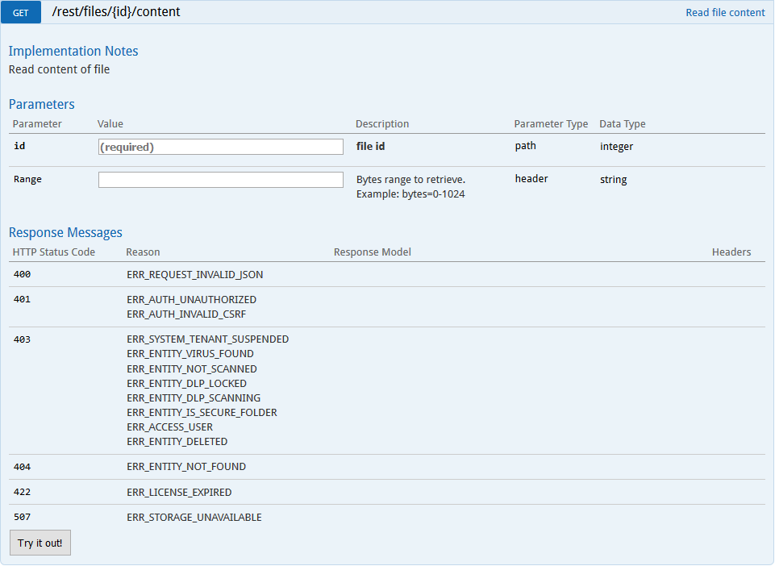

# Downloading Files  
The first **id** needed for this web request is the **id** of the file to be downloaded. Once the web request returns, your response should be the file that was added.

<aside class="notice">

Files that are not text files will have a garbled response when downloaded using the Developer Documentation page. </aside>  

