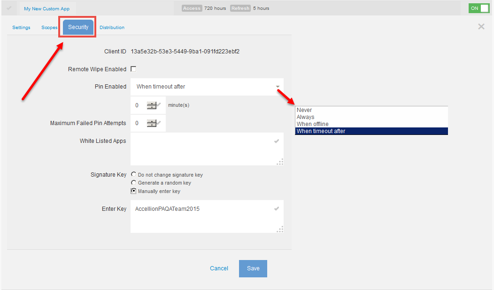

# Enabling the kiteworks API Playground UI

The following steps help you get started with the kiteworks API Playground. Exploring using kiteworks APIs requires development experience.

Step 1.	On the Application page, click on **Custom Applications** under **Client Management**.

Step 2.	The **Enable kiteworks API Playground UI** switch should be **ON**. If the switch is turned off, click on the switch to turn it ON.

Step 3.	To view the complete list of APIs, click **Developer Documentation** located under the **Help (?)** icon of the kiteworks Admin console as shown below.

The **Developer Documentation** page displays with the listing the library of APIs as shown below.

## Creating your Custom Application

Click on the "**+**" "**Plus sign**" to add your new customized application.

The **Add Custom Application** window displays.

Populate the fields and click **Add Application**. A confirmation **Add Client Application** window displays giving you the **Client Application ID** and the **Client Secret Key**. Make a note of this information in a safe place as this information will be needed for developing the client application. Click **OK**.

Your new custom application is created as shown below.

## Customizing Settings, Scopes, Security and Distribution

Select **My New Custom App**, the application you just created as shown in the screen capture above, to configure the **Settings, Scopes, Security and Distribution**.

### Settings 

You can make changes to the settings, if desired. Click **Save**.

### Scopes 

Select the APIs you plan to use for your custom application. By default, all APIs are selected when you first create the application. Click **Save**.

### Security

**Remote Wipe Enabled:**
Enable Remote Wipe for this application.

**Pin Enabled:**
Specify whether a PIN should be enabled for this application. Recommended for mobile apps.

**White Listed Apps:**
List third-party mobile apps that can be used to open files via the Open-In menu.

**Signature Key**
You can generate a random key or manually enter a key. Select **Do not chane signature key** if no change is required. Click **Save**.

### Distribution

You can distribution the applcation you just created after submission for certification and approval.

You are now ready to test your app. 

Go to https://%%HOST%%/oauth_callback.php /rest/index.html to test your app using the app credentials. 

**Note:** 	“your kiteworks hostname” is the name of your kiteworks deployment.
