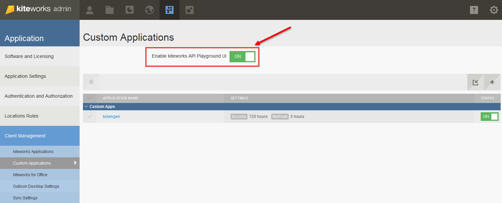
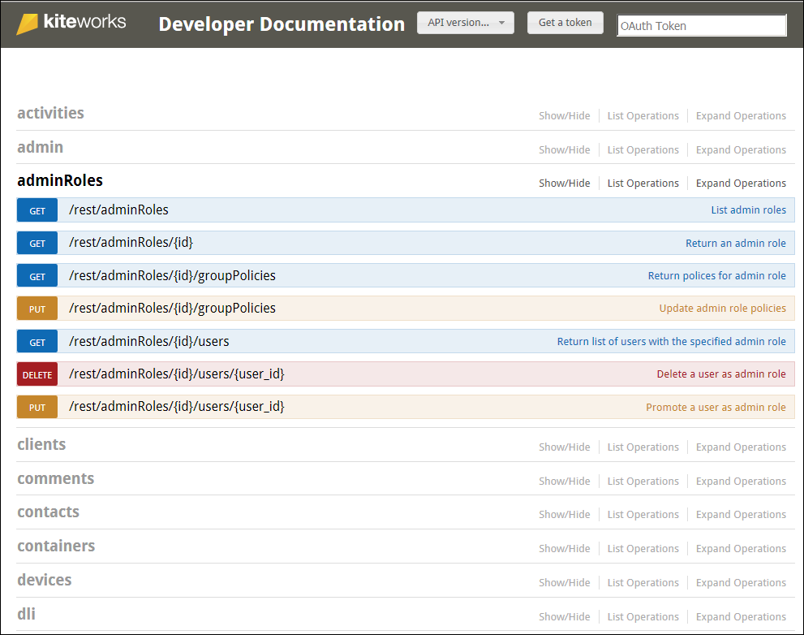
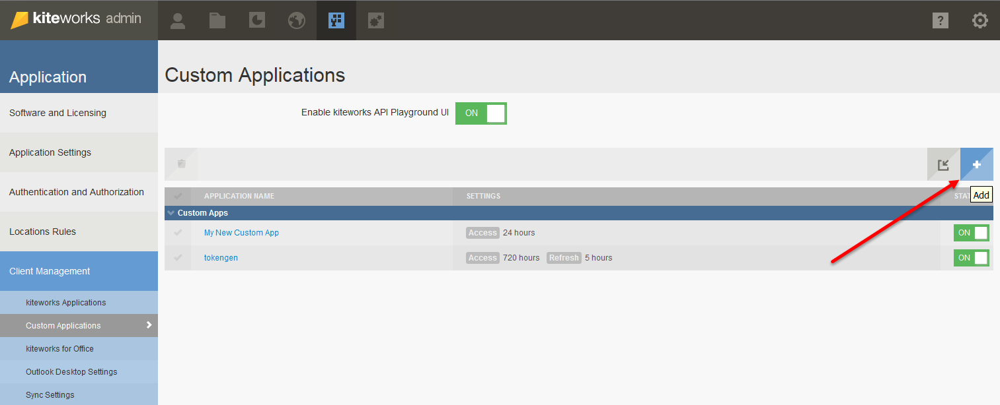
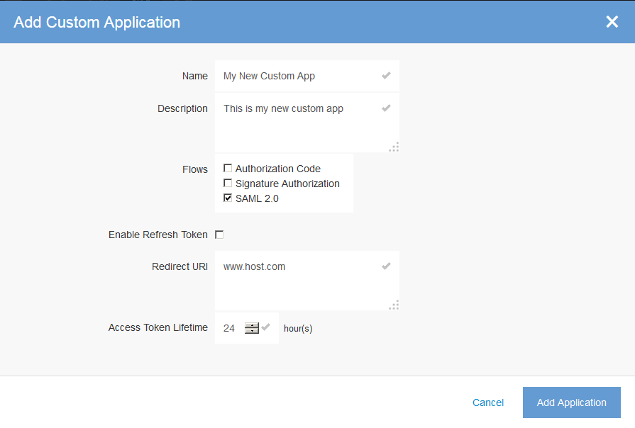
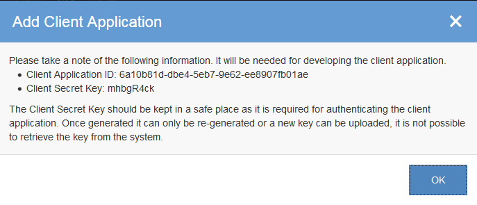

# Enabling the kiteworks API Playground UI

The following steps help you get started with the kiteworks API Playground. Exploring using kiteworks APIs requires development experience.

Step 1.	On the Application page, click on **Custom Applications** under **Client Management**.

Step 2.	The **Enable kiteworks API Playground UI** switch should be **ON**. If the switch is turned off, click on the switch to turn it ON.

Step 3.	To view the complete list of APIs, click **Developer Documentation** located under the **Help (?)** icon of the kiteworks Admin console as shown below.

The **Developer Documentation** page displays with the listing the library of APIs as shown below.

## Creating your Custom Application

Click on the "**+**" "**Plus sign**" to add your new customized application.

The **Add Custom Application" window displays.

Populate the fields and click **Add Application**. A confirmation **Add Client Application" window displays giving you the **Client Application ID** and the **Client Secret Key**. Make a note of this information in a safe place as this information will be needed for developing the client application. Click **OK**.

Your new custom application is created as shown below.

Customizing Settings, Scopes and Security
Select the Application Name you just created, and customize the Settings, Scopes, and Security.
Settings 
You can make changes to the settings, if desired.

