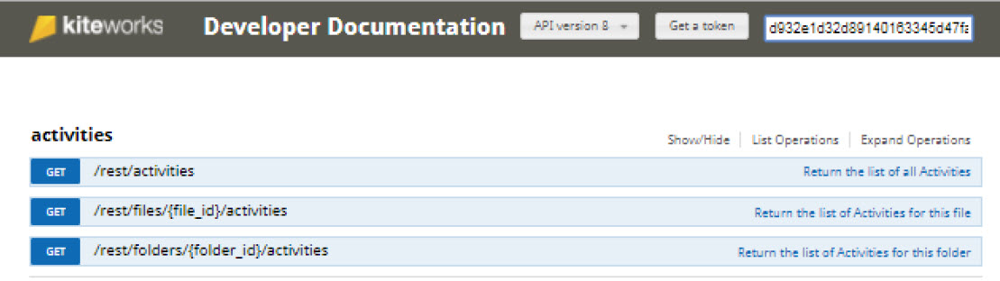
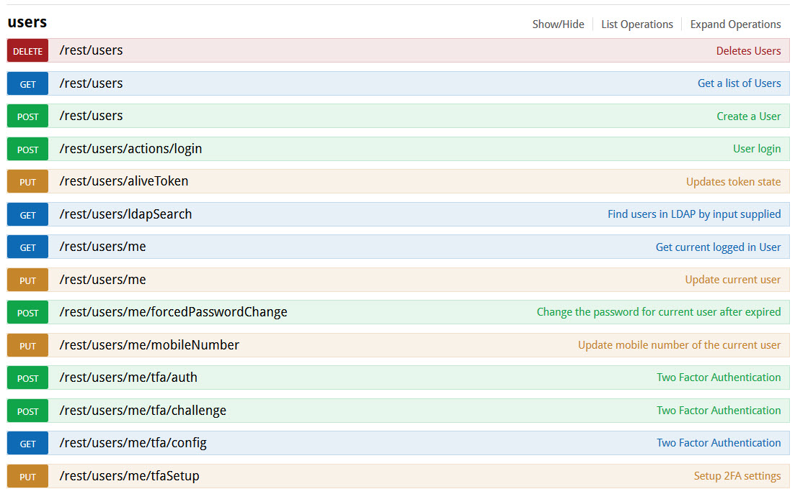
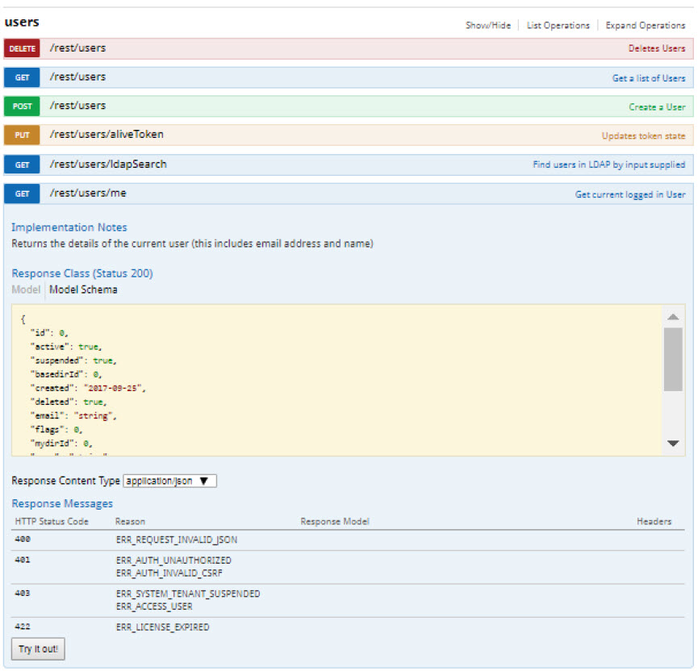

# Execute API Calls

Once the access token is obtained, you will need to paste it in the **OAuth Token** field as shown below.

Let us begin with performing a basic API call. In the body of the webpage, there is a list of entities, each of which correspond to a different part of kiteworks and is represented with a JSON payload. When an entity name is clicked, the interface will expand to show all of the endpoints associated with that entity. An endpoint is a web request that performs a task related to the entity it falls under.
 
As an example, navigate to the **users** entity.

Here, you can see the list of endpoints associated with the **users** entity. For clarity purposes, they are color coded based on what method is being used. To the right of each list item, there is a brief description of what the entity does.

When an item in this list is clicked, the interface will expand again to show information relevant to the selected endpoint.

Click on the endpoint **GET /rest /users/me**.

Go over the details for this endpoint. In summary, it returns a JSON representation of the entity that is populated with information that the access token represents. This information is tied to the current user. Once you've gone over the information for the endpoint, click the **Try it out!** button

In the **Response Body** section, there will be a JSON object of the **users** class, and it will contain the current user's information.
