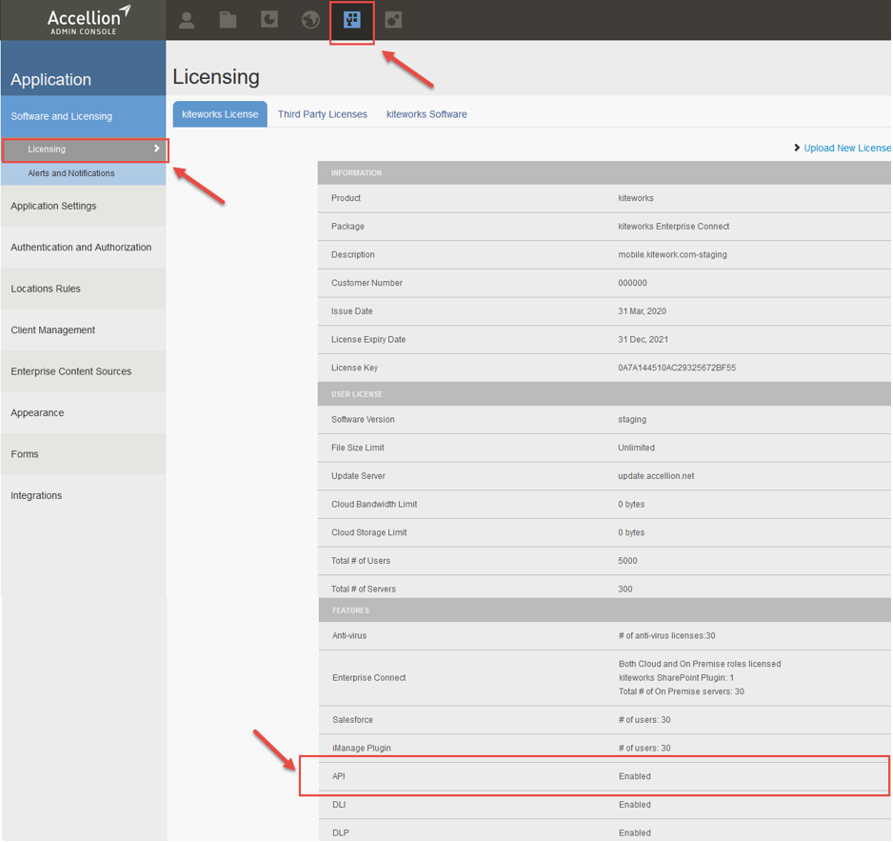

# Licensing
The RESTAPI is available on every Accellion Enterprise package that has the Automation Suite enabled.

Perform the following two steps to see if you have a license for the Accellion APIs:
1.	Log into an Accellion system and click on the Application icon as shown below. 
2.	Click on Licensing on the left panel.
The API is listed in the Features section and it will be enabled if you have an Accellion Enterprise package.   

