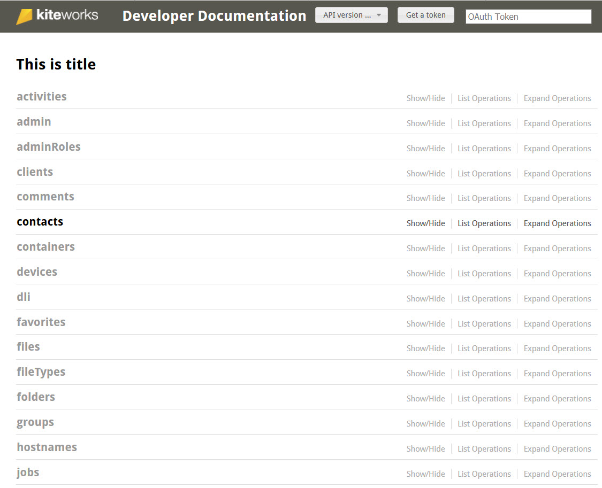
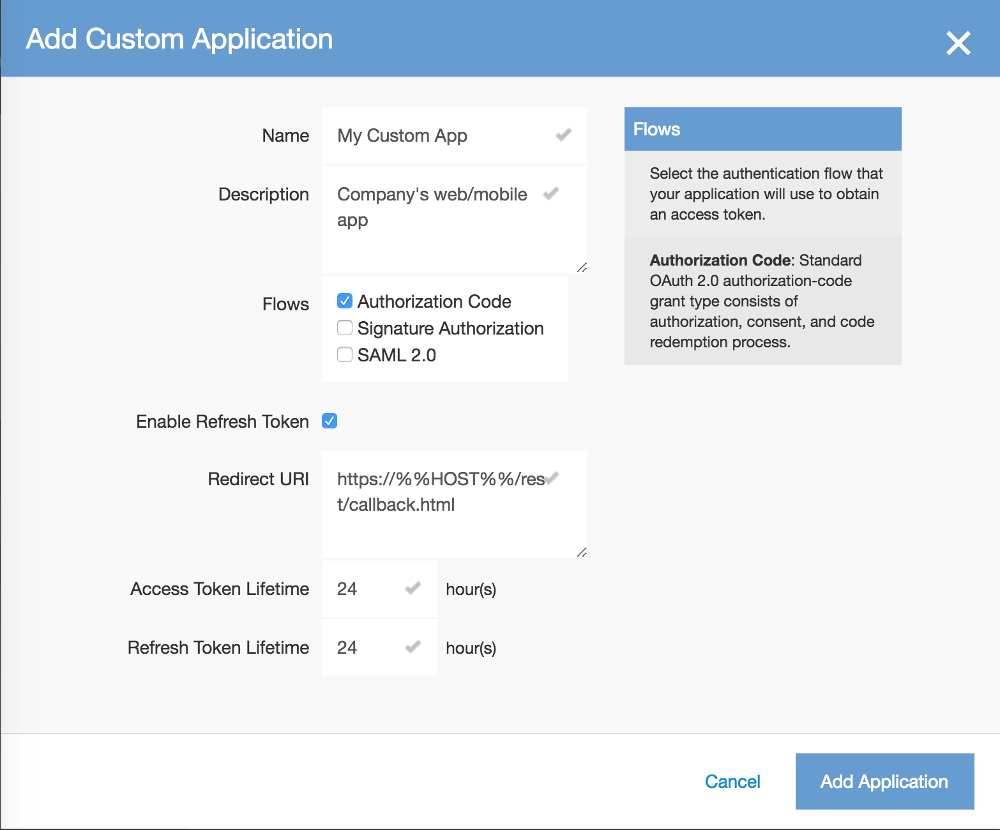
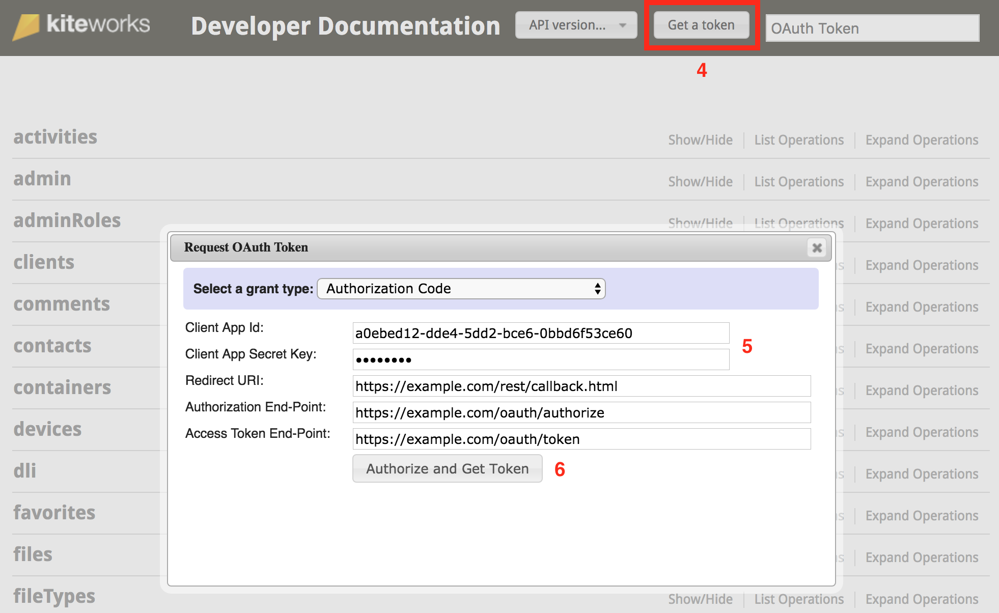
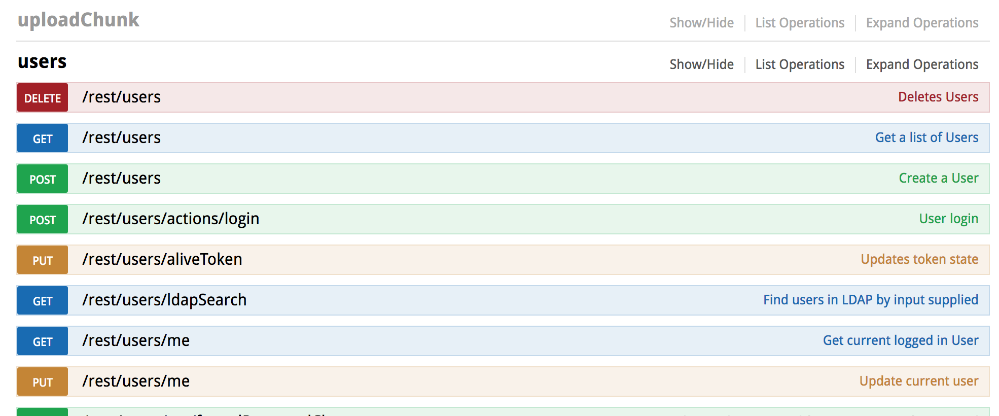
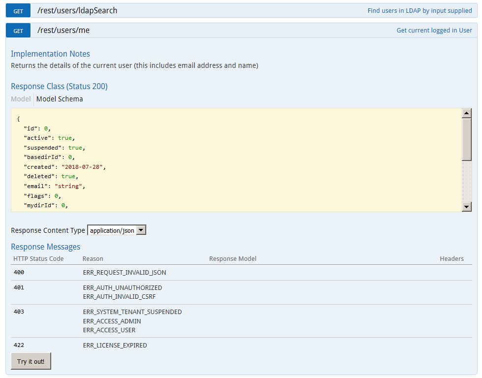
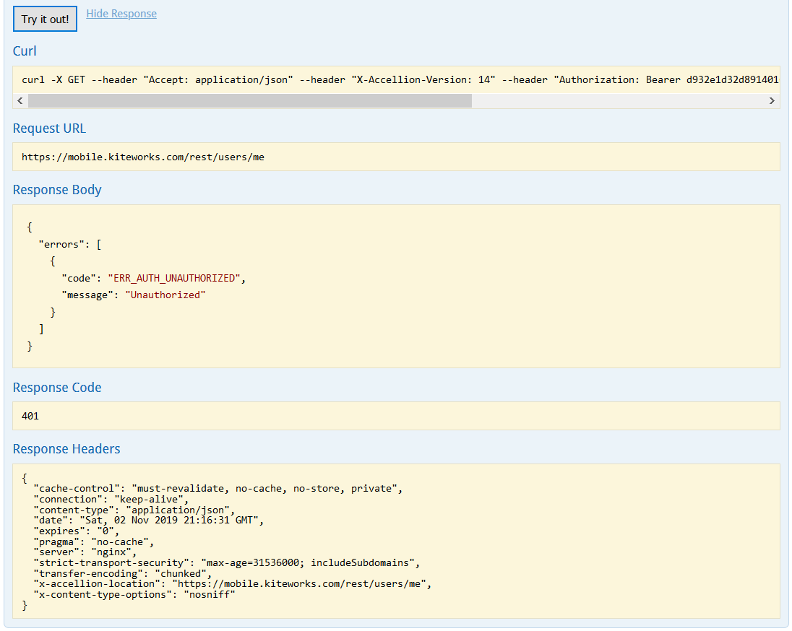

# Prerequisites
It is assumed that the reader is familiar with the following concepts and technologies used within the Accellion API framework:
*	Representational State Transfer (REST) architectural styles  
*	RESTful style constraints and implementation
*	OAuth 2.0 Protocol
*	JavaScript Object Notation (JSON) format and structure
*	Hypertext Transfer Protocol (HTTP) terminology, methods, and status codes
*	Multipart MIME (Multipurpose Internet Mail Extensions) requests

# Get an Accellion instance
You will need an Accellion instance to get access to the API. If you don't already have one, please click on the button below:

# Licensing
The RESTAPI is available on every Accellion Enterprise package that has the Automation Suite enabled.

Perform the following two steps to see if you have a license for the Accellion APIs:
1.	Log into an Accellion system and click on the Application icon as shown below. 
2.	Click on Licensing on the left panel.
The API is listed in the Features section and it will be enabled if you have an Accellion Enterprise package. 

# Enabling the Accellion API Playground
Perform the following steps to enable the Accellion API Playground:
1.	Click on the Application > Client Management > Custom Applications as shown below. 
2.	Click on Enable kiteworks API Playground UI  ON/OFF switch to enable it if it not enabled.
A confirmation window displays, click OK to enable the playground.

## Setup your first custom app
If you already have an Accellion instance:

1. Sign in to the Admin interface at https://[hostname]/admin. Replace [hostname] with your Accellion instance hostname.
2. Click on the Application tab icon using the top navigation bar.
3. Click on Client Management in the left navigation panel. **NOTE**: If you see the Custom Applications section under Client Management, you have everything you need to get started. Otherwise, please email <support@accellion.com> to request API access for your instance.
4. Click on Custom Applications under Client Management.
5. Click on the + button to add your custom app. Further steps below the screenshot.

6. Fill up the Add Custom Application form as per your needs. Our example app will use standard OAuth 2.0 Authorization Code flow with refresh token. **NOTE**: If you want to test this app in the playground, set the Redirect URI to https://%%HOST%%/rest/callback.html. After testing, this should be changed to your app's own redirect URI.

7. Click on the Add Application button.
8. Copy and save the Client Application ID and Client Secret Key from the popup to a secure location. **NOTE**: This is your only chance to copy the secret key.
9. Click OK. Your custom application is now created and you are ready to start experimenting in the playground.

## Get a token
Once the playground has loaded (resource list has been fetched), click the **Get a token** (1) button near the top right.

You can request a token from the following grant types:
*	Authorization Code
*	Signature-based Authorization Code
*	Signature-based Access
*	User Credential 
*	User Credential (using HTTP Basic Authorization)
*	SAML 2.0 Assertion
*	JWT Assertion

In the popup form, **Authorization Code** grant type is selected by default. Enter the **Client App ID** and **Client App Secret Key** (2) of the custom app you created in the previous section.
Click **Authorize and Get Token** (3).

Click "Grant Access" in the new End-User Authorization popup. The playground will receive a token from the Accellion server and display it in the top right. You are now ready to make your first API call from the playground.

## Call an endpoint
Now that the playground has the access token, it is time to perform a basic API call.

On the playground webpage, you will see several categories like activities, admin, etc. Clicking on a category name expands it, showing all the endpoints in it. The categories are arranged alphabetically.

Scroll down and click the **users** category.

The endpoints are color coded based on the HTTP method. To the right of each endpoint, there is a brief description of its purpose.

Click on the endpoint **GET /rest/users/me** to see more details about it.

Click the **Try it out!** button. In the **Response Body** section, you will see a JSON object of the **users** class, and it will contain the current user's information.

