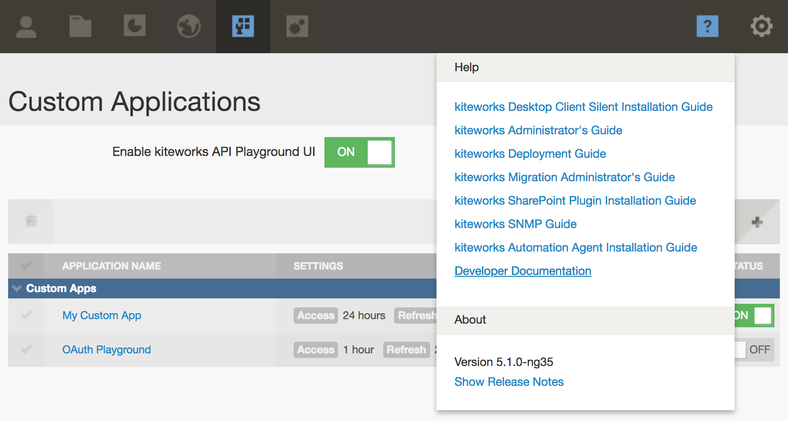

# Quickstart

## Prerequisites
You should be an experienced developer and have an understanding of the following concepts and technologies:

* OAuth 2.0
* Understand the format, structure and common paradigm of JSON
* HTTP methods and status codes
•	Formulate web requests for common methods, e.g., GET, POST, PUT, and DELETE They have a working knowledge of multipart MIME requests
* REST APIs

## Get an Accellion instance
You will need an Accellion instance to get access to the API. If you don't already have one, please click on the button below:

## Setup your first custom app
If you already have an Accellion instance:

1. Sign in to the Admin interface at https://[hostname]/admin. Replace [hostname] with your Accellion instance hostname.
2. Click on the Application tab icon using the top navigation bar.
3. Click on Client Management in the left navigation panel. **NOTE**: If you see the Custom Applications section under Client Management, you have everything you need to get started. Otherwise, please email <support@accellion.com> to request API access for your instance.
4. Click on Custom Applications under Client Management.
5. Click on the + button to add your custom app. Further steps below the screenshot.

6. Fill up the Add Custom Application form as per your needs. Our example app will use standard OAuth 2.0 Authorization Code flow with refresh token. **NOTE**: If you want to test this app in the playground, set the Redirect URI to https://%%HOST%%/rest/callback.html. After testing, this should be changed to your app's own redirect URI.

7. Click on the Add Application button.
8. Copy and save the Client Application ID and Client Secret Key from the popup to a secure location. **NOTE**: This is your only chance to copy the secret key.
9. Click OK. Your custom application is now created and you are ready to start experimenting in the playground.

## Setup the playground
1. On the Custom Applications page in Admin interface, turn the API playground ON. Click OK in the confirmation popup.
2. Click the "?" icon near the top right.
3. Click "Developer Documentation". This should open the playground in a new tab.

## Get a token
Once the playground has loaded (resource list has been fetched), click the **Get a token** (1) button near the top right.

You can request a token from the following grant types:
*	Authorization Code
*	Signature-based Authorization Code
*	Signature-based Access
*	User Credential 
*	User Credential (using HTTP Basic Authorization)
*	SAML 2.0 Assertion
*	JWT Assertion

In the popup form, **Authorization Code** grant type is selected by default. Enter the **Client App ID** and **Client App Secret Key** (2) of the custom app you created in the previous section.
Click **Authorize and Get Token** (3).

Click "Grant Access" in the new End-User Authorization popup. The playground will receive a token from the Accellion server and display it in the top right. You are now ready to make your first API call from the playground.

## kiteworks Authorization Code (OAuth 2.0 Flow)
The kiteworks APIs allows any new client application (client for short) to be developed for the kiteworks solution. The APIs can be used by the client to gain access to resources belonging to a user on the kiteworks server. The APIs can only be used by a client that is registered on the kiteworks server.

A client must provide an access token to access resources belonging to a user on the kiteworks server. The kiteworks server provides access token provisioning flows based on the OAuth 2.0 (https://tools.ietf.org/html/rfc6749). The majority of clients will consume the so-called Authorization Code Flow to obtain an access token. This flow is developed based on the authorization code grant type of the OAuth 2.0 specification.

This document provides a step-by-step guide for application developers to build a client for consuming the Authorization Code Flow to obtain an access token and use the access token to access users’ resources on a kiteworks server. Example codes for Android based clients are also provided. 

## Obtaining Access Token Requirements
For obtaining an access token using the kiteworks Authorization Code Flow, you need the client registration information recorded in the previous steps:

*	**client_id** – This is a unique system generated id of your client.
*	**client_secret** – This secret serves as a password for your client to authenticate itself to the kiteworks server.
*	**redirect URI** – This is the URI on which your client must listen for the authorization result. For mobile clients or for clients that cannot be redirected to another service, the landing page https://<kiteworks_server>/oauth_callback.php can be used.
*	**scope** – This is the set of API services that your client wants to access. Consult with your administrator regarding which scopes are available for your client.
*	**grant_type** – REQUIRED.  Value MUST be set to "authorization_code".
**NOTE**: You might need to specify grant_type when generating the code first. If the grant_type is not specified in the auth code request, you might get an error “grant_type was not specified” when requesting the token with that auth code saying the. One the grant_type is specified in the initial auth code request, the code works for the access token request.

## Sequence Overview
The sequence of the Authorization Code Flow is as follows:
1.	The client initiates the flow by redirecting the user-agent (browser or web view component) to the appropriate authorization page on the server. The client includes its ID and a redirect URI to which the server will send the user back once access is granted or denied.
2.	The server authenticates the user using a login page similar to web client login page and establishes whether the user grants or denies the client's access request.
3.	If the user grants access, the server redirects the user-agent to the redirection URI provided earlier. The URI also includes an authorization code that can be used to request an access token for that user.
4.	The client requests an access token from the server by authenticating itself (using its ID and secret) and including the authorization code received in the previous step.
5.	The server validates the client credentials and the authorization code and responds with the access token. The client uses the access token to invoke APIs for accessing user’s resources. 
## Step-by-step Usage
The request-response of this flow follows the specification of OAuth 2.0 protocol (http://tools.ietf.org/html/rfc6749#section-4.1). All requests for authorization and for calling service must be done through HTTPS. The URI end-points of this flow are as follows:
*	Authorization end-point: https://<hostname>/oauth/authorize
*	Token end-point: https://<hostname>/oauth/token
All request parameters, unless otherwise specified, must be passed through HTTP POST parameters. The response body will be in JSON format. The following information describes this in more detail.

## Step 1 Authorization Request
The first step is to call the Authorization end-point with the request parameters passed via HTTP GET. Depending on the case, the user may be prompted with a dialog to authenticate and then to authorize the request for access permission by the client application. The following parameters must be passed in the request to the Authorize URI (this follows the OAuth 2 specification).

*	**client_id** – is the identifier of the client-application as registered in the server. For example ‘playground’.
*	**redirect_uri** – is the URI to which the result of the authorization will be passed. This redirect URI must start with the URI specified at the time of the creation/registration of the client application. For example, if the client application had registered with the redirect URI of https://mydomain.com/oauth then the client application may provide https://mydomain.com/oauth/callback as redirect_uri parameter in this request. Note, that this parameter must be properly URL-encoded.
*	**response_type** – the value of this parameter must be set to “code”.
*	**scope** – is the scope of the API services that the client wants to access. This is a space-separated string consisting of the name of the method and API services that the application requires. For example: “GET/users/* */files/*”. The requested scope must be a sub-set of the client application's registered scope in the server. If a blank scope is provided, the registered scope will be assumed.
*	**m** (optional parameter) – set to 1 to display mobile friendly authorization page.
*	**state** (optional parameter) – is an optional parameter that the client application may pass in order to maintain the state of its process. The server will pass back this parameter as-is in the response. 

## Call an endpoint
Now that the playground has the access token, it is time to perform a basic API call.

On the playground webpage, you will see several categories like activities, admin, etc. Clicking on a category name expands it, showing all the endpoints in it. The categories are arranged alphabetically.

Scroll down and click the **users** category.

The endpoints are color coded based on the HTTP method. To the right of each endpoint, there is a brief description of its purpose.

Click on the endpoint **GET /rest/users/me** to see more details about it.

Click the **Try it out!** button. In the **Response Body** section, you will see a JSON object of the **users** class, and it will contain the current user's information.

