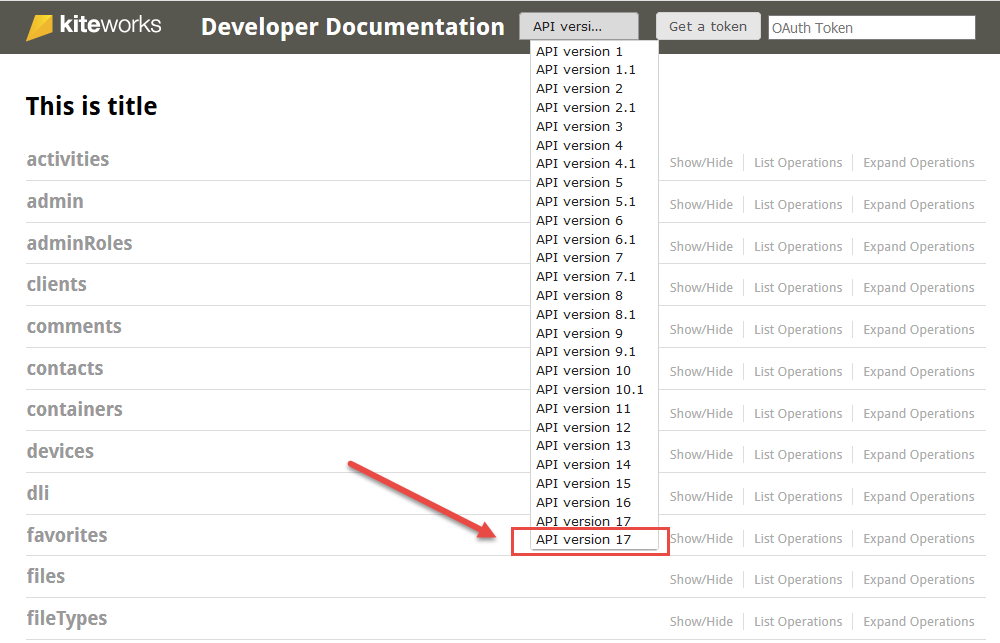

# Accellion API Playground Documentation (Swagger Interface)  
The Accellion APIs are used by the custom applications to access user resources on a Accellion server.  

**API Usage** – The APIs follow the REST architectural style and use the scheme of addressing a resource and invoking a method on that resource.  
**The API URI** – All APIs can be called using the following URI scheme: <https://<hostname>/rest/<resources>  
**API Output 88 – The API result is returned in JSON format.  

To access the Accellion the API Playground, click on the **? (Help)** icon and select **Developer Documentation** as shown below or type in the URL of the kiteworks instance/rest/index.html.  

  

The **Developer Documentation** Swagger Interface displays. 

There are several API versions, all of which are supported. To maintain and enhance security and performance, Accellion rolls out API versions periodically. It is recommended to configure the application to run the latest API version which ensures the benefit of using the latest features.

Click on **API version** and select the latest API version before you start using the APIs.

  
