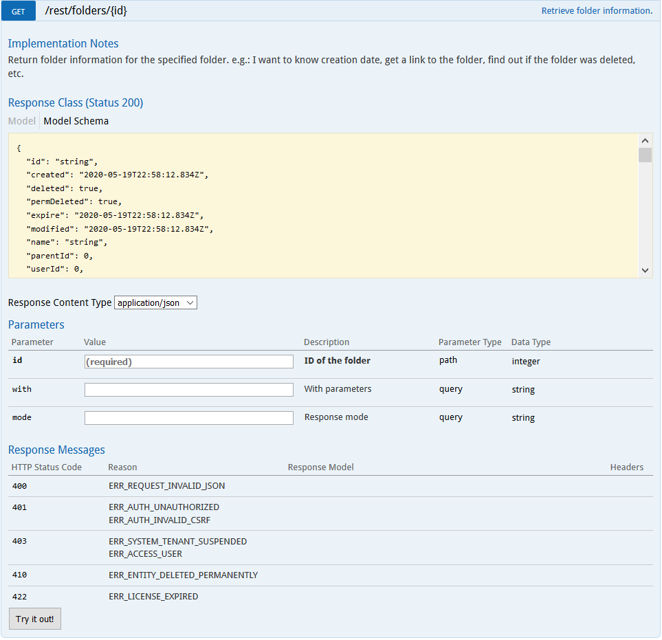
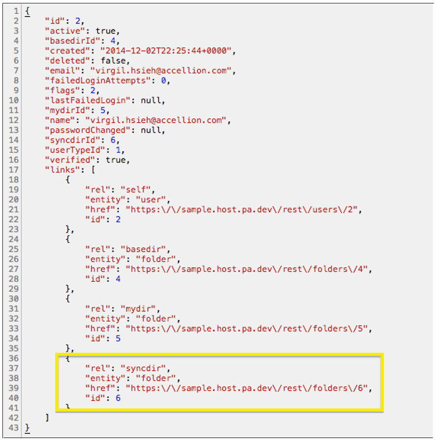
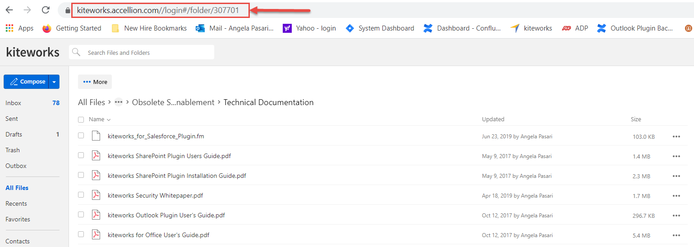
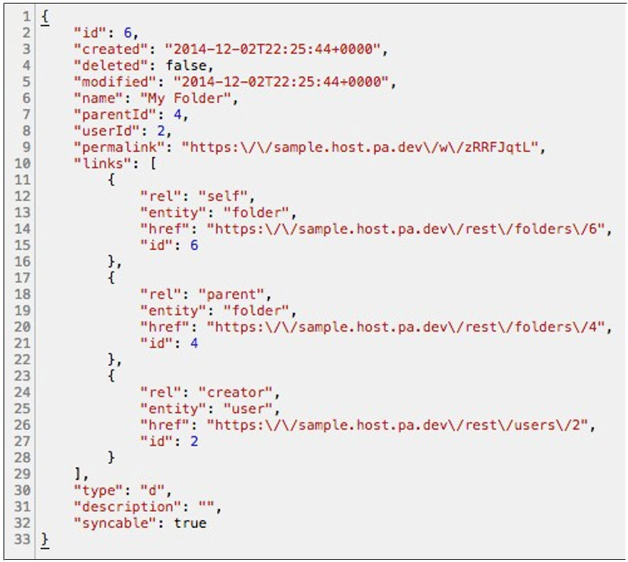

# Using id

Another request can be made that uses an **id** to uniquely identify the object you want to get. In this example a folder object is being created that represents the **My Folder** folder for the current user.

The folders entity does not have an endpoint to return the current user's **My Folder** folder. The general endpoint for getting folders visible to the current user will have to be used, and the **id** of the folder must be given in the request to specify which folder to get.  

There are a number of ways to get the **id** of the **My Folder** folder for the current user.

Make the **GET /rest/users/me** request. In the response of that request, there is a **links** array, in which there is an element identified as **syncdir**. The **id** associated with that element is the **id** of the **My Folder** folder for this user.

This method of obtaining the id is specific to the **My Folder** folder of the user, and it cannot be used to get the **id** of any folder. A more general way to obtain the **id** of a folder is to navigate to that folder in the kiteworks UI. Once there, observe the URL.  

The URL should read **https://<hostname>/#/folder/** followed by a number. That number is the **id** of the folder that is currently open.

  

In some instances URLs are not available in the **id**.  In those cases, the best way to get the **id** of a specific object would be to use the corresponding endpoint that lists all instances of the class you are interested in. From the list, you can then pick which instance is the one you are interested in, and from there, you can get the **id**.   

Plug in the **id** of the **My Folder** folder in the web request and the response will be a JSON payload that contains information relevant to that folder.

  
  
