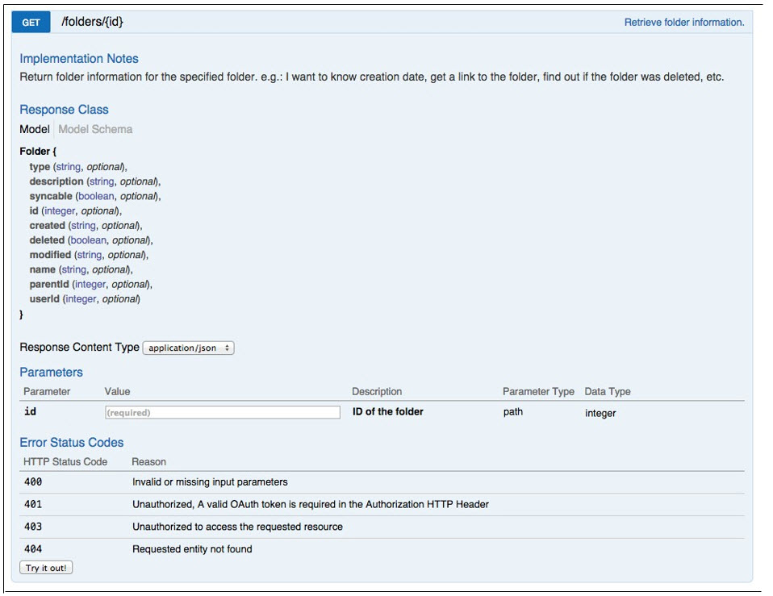

# Using id

Now that you can make requests using our API to get data from kiteworks, let's try another request that uses an id to uniquely identify the object you want to get. Specifically, let's try to get a folder object that represents the **My Folder** folder for the current user.

Unlike the users entity, which has the aforementioned endpoint to return the current user's information, the folders entity does not have an endpoint to return the current user's **My Folder** folder. The general endpoint for getting folders visible to the current user will have to be used, and the **id** of the folder must be given in the request to specify which folder to get. If we look in the developer documentation, such an endpoint exists.

There are a number of ways to get the **id** of the **My Folder** folder for the current user, which I will outline here currently.

One is simply to make the **GET /users/me** request. In the response of that request, there is a **links** array, in which there is an element identified as **syncdir**. The **id** associated with that element is the **id** of the **My Folder** folder for this user.
