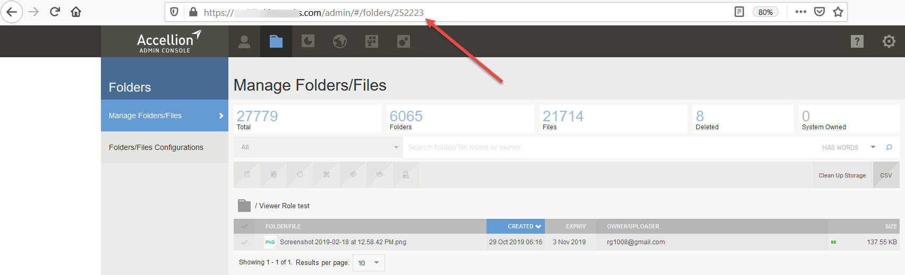

# Using id

Now that you can make requests using our API to get data from kiteworks, let's try another request that uses an id to uniquely identify the object you want to get. Specifically, let's try to get a folder object that represents the **My Folder** folder for the current user.

Unlike the users entity, which has the aforementioned endpoint to return the current user's information, the folders entity does not have an endpoint to return the current user's **My Folder** folder. The general endpoint for getting folders visible to the current user will have to be used, and the **id** of the folder must be given in the request to specify which folder to get. If we look in the developer documentation, such an endpoint exists.

There are a number of ways to get the **id** of the **My Folder** folder for the current user.

One is simply to make the **GET /users/me** request. In the response of that request, there is a **links** array, in which there is an element identified as **syncdir**. The **id** associated with that element is the **id** of the **My Folder** folder for this user.

This method of obtaining the id is specific to the **My Folder** folder of the user, and it cannot be used to get the **id** of any folder. A more general way to obtain the **id** of a folder is to navigate to that folder in the kiteworks UI. Once there, observe the URL.

The URL should read **https://<hostname>/#/folder/** followed by a number. That number is the id of the folder that is currently open.
While this will work for the majority of cases - **folders** being one of them, there are a few instances where there are not available URLs to grab the **id** from.  In those cases, the best way to get the **id** of a specific object would be to use the corresponding endpoint that lists all instances of the class you are interested in. From the list, you can then pick which instance is the one you are interested in, and from there, you can get the **id**.
Now that we have the **id** of the **My Folder** folder, we can plug it into the web request, and our response will be a JSON payload that contains information relevant to that folder.
  
  
